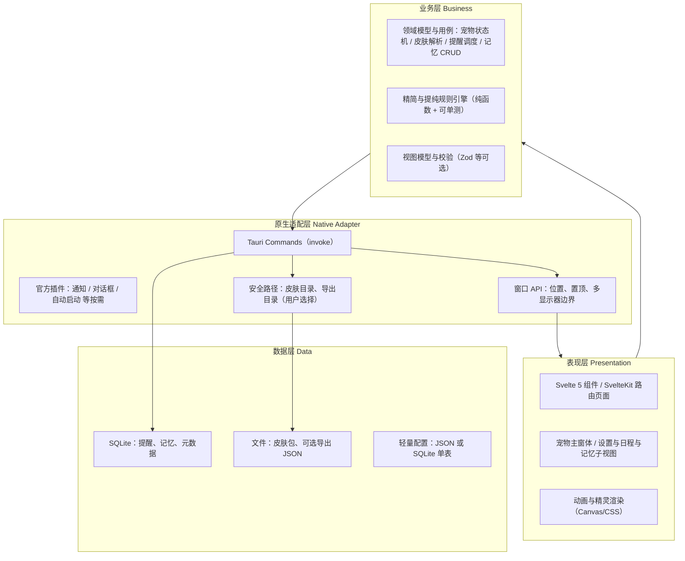

# PetPal 技术架构设计

| 属性 | 内容 |
|------|------|
| 对应需求 | `docs/PRD.md` v0.2、`docs/SRS.md` v0.2 |
| 全局约束 | `.cursor/rules/petpal-*.mdc`（**注意**：根目录 `.cursorrules` 已废弃，以本目录规则为准） |
| 文档版本 | v0.1 |
| 状态 | 草案，待评审确认 |

---

## 1. 技术选型说明

### 1.1 锁定栈：Tauri 2 + Svelte 5 + TypeScript + Rust

与 PRD 及 `.cursor/rules/petpal-tech-stack.mdc` 一致；当前工程骨架为 **Tauri 2 + SvelteKit（Svelte 5）+ Vite**，Rust 侧位于 `src-tauri`。

### 1.2 选型理由与对比

| 维度 | Tauri + Svelte + Rust | 常见替代 | 结论 |
|------|------------------------|----------|------|
| **体积与内存** | 系统 WebView + 小体积 Rust 二进制，无捆绑 Chromium | **Electron**：捆绑 Chromium，常驻内存显著偏大 | 满足 PRD「轻量」与 `petpal-performance.mdc` |
| **安全与攻击面** | 前端受限能力 + Tauri 2 **capabilities** 显式授权 | Electron：Node 与浏览器同源混合，配置不慎易扩大攻击面 | 利于「最小权限」与合规验收 |
| **跨平台交付** | 一套前端 + 条件编译/平台 crate 处理差异 | **Flutter 桌面**：自绘 UI，与「Web 技术栈 + 皮肤 HTML/CSS」路线不一致 | 与皮肤包、快速迭代 UI 更匹配 |
| **原生能力** | Rust 生态处理文件、定时、通知、窗口属性 | **Wails（Go）**：后端语言与团队 Rust 约束不符 | Rust 与 Tauri 一体，便于事务型存储与算法（记忆精简/提纯） |
| **UI 框架** | **Svelte 5**：编译期优化、组件模型适合动画与小型界面 | React：运行时更重；Vue：可选，但项目已锁定 Svelte 5 | 减少 bundle，利于性能基线 |

**结论**：在「MIT、本地数据不上传、低常驻资源、跨三平台安装包」目标下，**Tauri 2 + Svelte 5 + Rust** 为综合最优解；不做 Electron 默认方案。

### 1.3 核心技术难点（来自 SRS）

| 难点 | 架构对策 |
|------|----------|
| 悬浮窗、点击穿透、多显示器 | 原生适配层统一封装窗口创建/边界；前端仅发意图（位置、always-on-top） |
| 空闲内存 &lt; 50MB、CPU &lt; 1% | 动画用 `requestAnimationFrame` + `document.visibilityState` 降频；Rust 侧无忙等；记忆/提醒用批量写与事务 |
| 记忆事务与崩溃一致性 | 数据层 SQLite + WAL + 单写连接；精简操作用显式事务 |
| 无外联合规 | 默认禁止网络权限；依赖审计；CI 可做「无未知出站」检查清单 |

---

## 2. 分层架构（Mermaid）



**数据流原则**：表现层不直接访问 SQLite；经 **Commands** 或薄封装 **Repository（TS 侧仅类型，实现在 Rust）** 保证单一事实来源与可测试边界。

---

## 3. 模块拆分清单

| 模块 | 职责 | 优先级 | 依赖 |
|------|------|--------|------|
| **window-shell** | 悬浮窗参数、拖动、置顶、边界钳制 | P0 | adapter-win |
| **pet-interaction** | 鼠标事件防抖、状态机 idle/hover/interact | P0 | window-shell, anim-player |
| **anim-player** | 精灵/序列帧调度、`requestAnimationFrame` 节流 | P0 | skin-loader（默认资源） |
| **skin-loader** | 解析 `manifest.json`、校验资源、热切换 | P1 | Fs（adapter） |
| **reminder-service** | 提醒 CRUD、下次触发计算、休眠唤醒校准 | P1 | data-store, adapter-notify |
| **memory-service** | 记忆 CRUD、分页、标星、存储上限 | P1 | data-store |
| **memory-prune** | 精简策略执行、事务、报告结构 | P1 | memory-service, Rules 纯模块 |
| **memory-purify** | 评分与预设、排序与归档视图模型 | P1 | memory-service |
| **settings-service** | 音量、自启、置顶等持久化 | P1 | data-store, adapter-autostart |
| **data-store** | SQLite 迁移、连接、事务封装 | P1 | —（Rust） |
| **export-local** | 用户显式导出记忆/快照到本地路径 | P1 | Fs |
| **build-release** | CI 构建三平台包、签名占位 | P0/P1 | 工程脚本 |

**依赖方向**：`presentation → business → adapter → data`；**禁止** `data → presentation`。

---

## 4. 接口定义（核心）

以下类型为 **契约**：前端 `@tauri-apps/api` `invoke` 载荷与 Rust `serde` 结构保持一致；实际字段以实现时定稿为准，评审时锁定。

### 4.1 TypeScript（`src/lib/types/` 建议路径）

```typescript
/** 记忆条目（与 FR-07 对齐） */
export type MemoryId = string;

export type MemoryKind = 'interaction' | 'note';

export interface MemoryEntry {
  id: MemoryId;
  createdAt: string; // ISO 8601，本地时区展示由 UI 转换
  kind: MemoryKind;
  /** 展示用摘要或正文 */
  body: string;
  starred: boolean;
  /** 可选：互动子类型，如 click / hover */
  interactionType?: string;
  /** 归档/淡化等视图用 */
  archived?: boolean;
}

/** 提醒（与 FR-05 对齐） */
export type ReminderId = string;

export interface Reminder {
  id: ReminderId;
  fireAt: string; // ISO 8601
  title: string;
  note?: string;
  once: boolean;
  consumed?: boolean;
}

/** 精简策略（与 FR-08 对齐） */
export interface PrunePolicy {
  /** 仅处理早于此日期的条目 */
  olderThan?: string;
  mergeSameDaySameKind: boolean;
  maxSummaryChars: number;
}

export interface PruneReport {
  mergedCount: number;
  bytesBefore: number;
  bytesAfter: number;
}

/** 提纯预设（与 FR-09 对齐） */
export type PurifyPresetId = 'starred_and_recent' | 'high_score_only';

export interface PurifyWeights {
  recency: number;
  frequency: number;
}

/** 皮肤 manifest 子集（与 FR-04 对齐） */
export interface SkinManifest {
  id: string;
  name: string;
  version: string;
  author?: string;
  frames: Record<string, string>;
  anchor?: { x: number; y: number };
  hitArea?: { x: number; y: number; w: number; h: number };
}

/** 窗口意图（发往原生层） */
export interface WindowLayoutIntent {
  x: number;
  y: number;
  alwaysOnTop: boolean;
}
```

### 4.2 Rust（`src-tauri/src/` 命令与模型）

```rust
use serde::{Deserialize, Serialize};

#[derive(Debug, Clone, Serialize, Deserialize)]
pub struct MemoryEntry {
    pub id: String,
    pub created_at_ms: i64,
    pub kind: String, // "interaction" | "note"
    pub body: String,
    pub starred: bool,
    pub interaction_type: Option<String>,
    pub archived: bool,
}

#[derive(Debug, Clone, Serialize, Deserialize)]
pub struct Reminder {
    pub id: String,
    pub fire_at_ms: i64,
    pub title: String,
    pub note: Option<String>,
    pub once: bool,
}

#[derive(Debug, Clone, Serialize, Deserialize)]
pub struct PrunePolicy {
    pub older_than_ms: Option<i64>,
    pub merge_same_day_same_kind: bool,
    pub max_summary_chars: usize,
}

#[derive(Debug, Clone, Serialize, Deserialize)]
pub struct PruneReport {
    pub merged_count: u32,
    pub bytes_before: u64,
    pub bytes_after: u64,
}

/// 示例：invoke 命令名与参数在 `lib.rs` 注册时与前端常量对齐
#[derive(Debug, Serialize, Deserialize)]
pub struct MemoryListQuery {
    pub limit: u32,
    pub offset: u32,
    pub kind_filter: Option<String>,
}
```

**说明**：时间戳在 Rust 侧用 **毫秒 UTC 存储**、前端展示转本地时区，可避免部分 DST 歧义；若产品要求「全本地墙钟」，可在 SRS 迭代中改为 `TEXT` 存本地 ISO。

---

## 5. 非功能架构

### 5.1 可观测性

| 类别 | 规范 |
|------|------|
| **日志** | Rust：`tracing` + 分级（`error`/`warn`/`info`/`debug`）；生产默认 `info`，文件可选落盘；**禁止**在日志中输出记忆正文全文（可脱敏/截断）。前端：仅 `debug` 开关，默认关闭。 |
| **性能指标** | 开发态：可选记录帧耗时、命令耗时（`invoke` 往返）；发布包不默认上报。验收时按 SRS 用手动采样记录内存/CPU。 |
| **崩溃** | 依赖平台与 Tauri；不引入第三方崩溃上报 SDK（合规）。 |

### 5.2 安全架构

| 项 | 方案 |
|----|------|
| **沙箱与能力** | Tauri 2 `capabilities`：按模块逐步放开；默认拒绝网络（`fetch` 若未使用则 CSP 收紧）。 |
| **权限最小化** | 仅申请：通知、文件对话框（皮肤/导出）、自动启动（可选）；写入仅限应用数据目录与用户选定目录。 |
| **数据加密** | 首版：**磁盘加密依赖 OS 全磁盘加密**；数据库文件不额外加密以降低复杂度。若后续威胁模型要求，可评估 SQLCipher 或文件级密钥（独立 ADR）。 |
| **供应链** | `cargo audit` / `npm audit` 进 CI；锁文件提交仓库。 |

### 5.3 兼容性（跨平台）

| 平台 | 适配要点 |
|------|----------|
| **Windows 10+** | WebView2 运行时；安装包捆绑或引导安装策略在发布文档说明。 |
| **macOS 12+** | Universal 二进制策略；公证/签名流程独立清单。 |
| **Ubuntu 22.04+** | WebKitGTK 依赖在文档与 `.deb` 依赖字段声明；其它发行版「尽力」+ Issue 模板收集环境。 |

**窗口行为**：多显示器边界、DPI 缩放通过 **原生层** 计算安全矩形，与 SRS「越界回退」一致。

---

## 6. 开发规范

### 6.1 代码目录结构（建议）

```text
petpal/
  src/                      # SvelteKit 前端
    lib/
      types/                # 共享类型（与 §4.1 对齐）
      services/             # 纯 TS 业务（可单测）
      components/
    routes/
  src-tauri/
    src/
      lib.rs
      commands/             # 按域拆分：memory.rs, reminder.rs, window.rs
      db/                   # 迁移 SQL、连接池
      models/               # serde 结构体
    capabilities/
    tauri.conf.json
  tests/                    # 前后端测试（E2E 可选 playwright）
docs/
  PRD.md  SRS.md  架构设计.md
```

### 6.2 命名规范

| 范围 | 约定 |
|------|------|
| **Rust** | `snake_case`；模块名短、可检索；命令函数 `verb_noun`（如 `list_memories`）。 |
| **TypeScript** | `camelCase` 变量函数；类型 `PascalCase`；文件名 `kebab-case.svelte`。 |
| **数据库** | 表名复数 `snake_case`；列与 Rust 字段映射用显式 rename。 |

### 6.3 提交规范（建议）

采用 [Conventional Commits](https://www.conventionalcommits.org/)：

- `feat(memory): ...` / `fix(window): ...` / `docs(arch): ...` / `test(reminder): ...`
- 合并前通过：类型检查、`cargo test`、前端单测与覆盖率门槛（见 `petpal-testing.mdc`）。

---

## 7. 技术风险与规避

| 风险 | 影响 | 规避 |
|------|------|------|
| Linux WebKit 版本碎片化 | 渲染差异、崩溃 | 锁定测试矩阵；文档写明依赖包名与最低版本 |
| 悬浮窗与系统合成器差异 | 透明/穿透异常 | 分阶段：先标准置顶窗，再迭代穿透；每平台单独验收 |
| SQLite 锁与 UI 线程 | 卡顿 | 所有 DB 在 Rust 异步/线程池执行，`invoke` 不阻塞 UI 过久；长任务进度事件 |
| 性能基线被功能拖累 | 无法达标 | 记忆列表虚拟滚动；精简/提纯批处理 + 进度条；性能回归作为 CI 手工关卡 |
| 未来本地 LLM 可选包 | 体积与内存激增 | 独立特性开关与下载包（opt-in），默认关闭，ADR 评审 |

---

## 8. 文档修订记录

| 版本 | 日期 | 说明 |
|------|------|------|
| v0.1 | 2026-04-02 | 初稿：选型、四层架构、模块、接口、非功能、规范与风险 |

---

**请产品/研发评审**：若确认本架构，下一阶段可拆解为 **ADR（关键决策）** 与 **数据库表结构** 设计，并与 SRS 验收项一一映射。若有修改意见（例如数据层坚持纯 JSON 而非 SQLite），请提出以便迭代本文档。
